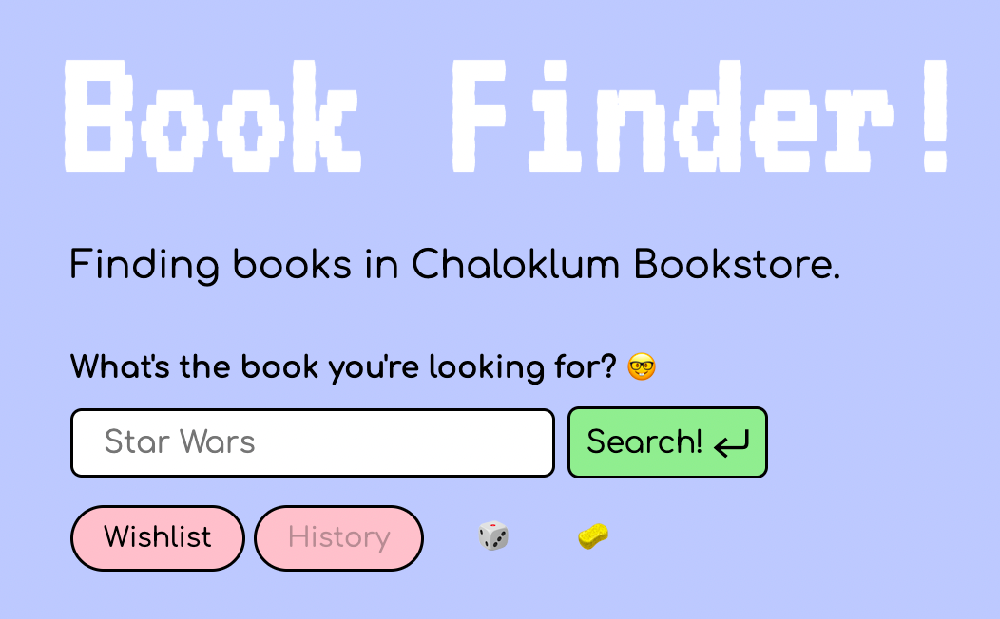
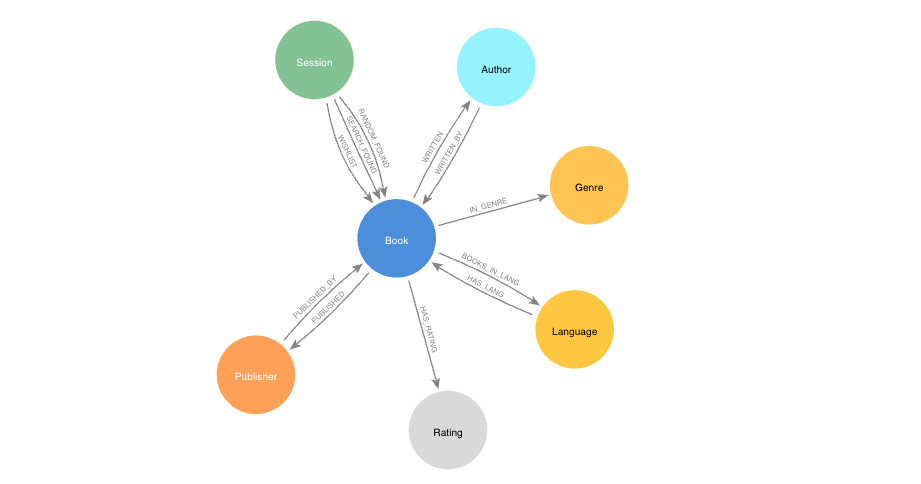

# GraphBook Finder: Book Finder Website for Bookstore Connected with Graph Database

GraphBook Finder is a web application designed to help users discover books available at the *Chaloklum Bookstore* using a graph database (Neo4j). The website provides an intuitive interface for users to search and explore the vast collection of books, making it easier for them to find their desired titles.

🚧 **Note:** Since this project uses free tier AuraDB Cloud Service it will pause the database after inactive for a while, this will cause the search function to not retrieved any books in the database.

## How do I get all these books' data?

Checkout my ISBN-based scrapping here: [ScrapBook-ISBN-based-retrieval](https://github.com/p4zaa/ScrapBook-ISBN-based-retrieval)

## Live Site Demo

The live demo version of the application can be accessed [here](https://chaloklum-books.glitch.me).  
> Due to inactive projects go to sleep and wake up on request. The demo website might take a little time to start the project.  

## Tools and Frameworks

The project is built using the following tools and frameworks:

*   Frontend: HTML, CSS
*   Backend: Node.js
*   Database: [Neo4j](https://neo4j.com/) (Graph Database)
*   Database Hosting: [Neo4j AuraDB Cloud Service](https://console.neo4j.io/)
*   Project Hosting: [glitch.com](https://glitch.com/)

## Features

*   **Book Search:** Users can search for books based on title using the powerful graph database query language, Cypher.
*   **Graph Database:** The application utilizes the Neo4j graph database to establish relationships between books, authors, genres, and other metadata, allowing for more efficient and flexible searches.
*   **User-Friendly Interface:** The website offers an intuitive and user-friendly interface, making it easy for both book enthusiasts and casual readers to navigate and find books of interest.
*   **Responsive Design:** The application is designed to be responsive, ensuring that users can access it from various devices and screen sizes.

## Data Model

## Process overview

## Contribution

Contributions to the project are welcome! If you find any bugs or have suggestions for improvements, feel free to create an issue or submit a pull request. Let's collaborate and make GraphBook Finder even better!

## License

This project is licensed under the [MIT License](https://en.wikipedia.org/wiki/MIT_License). Feel free to use, modify, and distribute the code according to the terms of the license.

## Contact

If you have any questions or need further assistance, you can reach out to the project maintainers:

*   Name: Pathompong Muangthong
*   GitHub: [@p4zaa](https://github.com/p4zaa)

Thank you for using GraphBook Finder! Happy book searching! 📚✨

---

